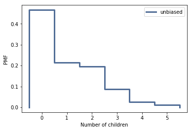
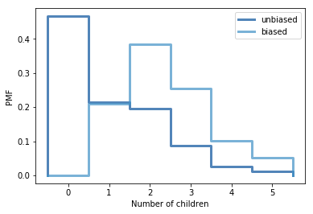

[Think Stats Chapter 3 Exercise 1](http://greenteapress.com/thinkstats2/html/thinkstats2004.html#toc31) (actual vs. biased)

>> *Question*: Something like the class size paradox appears if you survey children and ask how many children are in their family. Families with many children are more likely to appear in your sample, and families with no children have no chance to be in the sample.

>> Use the NSFG respondent variable **numkdhh** to construct the actual distribution for the number of children under 18 in the respondents' households.

>> Now compute the biased distribution we would see if we surveyed the children and asked them how many children under 18 (including themselves) are in their household.

>> Plot the actual and biased distributions, and compute their means.


Answer: Again, here we leverage some of the code available in the ThinkStats2 book. First, the actual pmf is plotted for the **numkdh** variable.

```python

resp = nsfg.ReadFemResp()
resp_pmf = thinkstats2.Pmf(resp.numkdhh, label='unbiased')

# Unbiased pmf
thinkplot.Pmf(resp_pmf)
thinkplot.Config(xlabel='Number of children', ylabel='PMF')

```



Next the both the biased and unbiased pmf are plotted together.

```python
biased_pmf = BiasPmf(resp_pmf, label='biased')
thinkplot.PrePlot(2)
thinkplot.Pmfs([resp_pmf, biased_pmf])
thinkplot.Config(xlabel='Number of children', ylabel='PMF')
```


The chart above shows how the biased pmf shows a distribution skewed to larger number of children. This is a similar paradox as the classroom size paradox introduced in the textbook.

```python
# Compute the mean of the unbiased and biased pmf

print("unbiased and biased mean:", resp_pmf.Mean() , biased_pmf.Mean())
```

```python
unbiased and biased mean: 1.02420515504 2.40367910066
```
Computing the mean also shows how the pmf has been skewed towards larger number of children, had a survey been performed.
