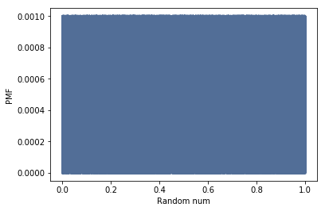
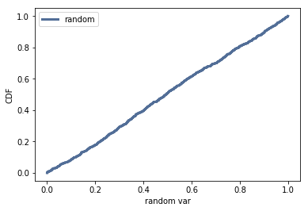

[Think Stats Chapter 4 Exercise 2](http://greenteapress.com/thinkstats2/html/thinkstats2005.html#toc41) (a random distribution)

>> *Question*: The numbers generated by numpy.random.random are supposed to be uniform between 0 and 1; that is, every value in the range should have the same probability.

>> Generate 1000 numbers from numpy.random.random and plot their PMF. What goes wrong?
Now plot the CDF. Is the distribution uniform?

Answer: The pmf of 1000 random numbers are plotted with the help from the functions in thinkstats2.

```python
# Generate 1000 random num
x = np.random.random(1000)

pmf = thinkstats2.Pmf(x)
thinkplot.Pmf(pmf)
thinkplot.Config(xlabel='Random num', ylabel='PMF')
```



The pmf looks like a block since there are so many data points. To check if the random numbers are uniform, the CDF plot can be examined.

```python
# CDF
cdf_x = thinkstats2.Cdf(x, label='random')
thinkplot.Cdf(cdf_x)
thinkplot.Config(xlabel='random var', ylabel='CDF', loc='upper left')
```


Since the CDF is a straight, diagonal line, we are confident that the distribution is uniform.
